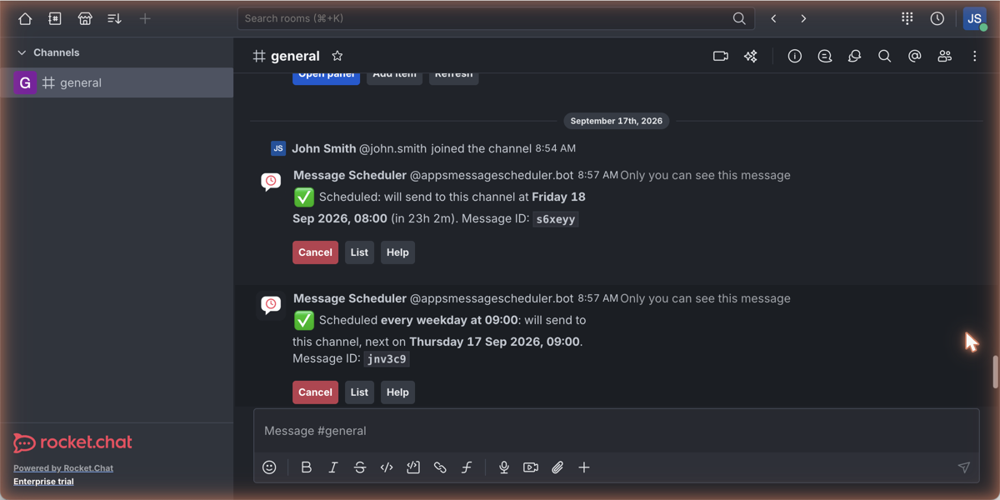
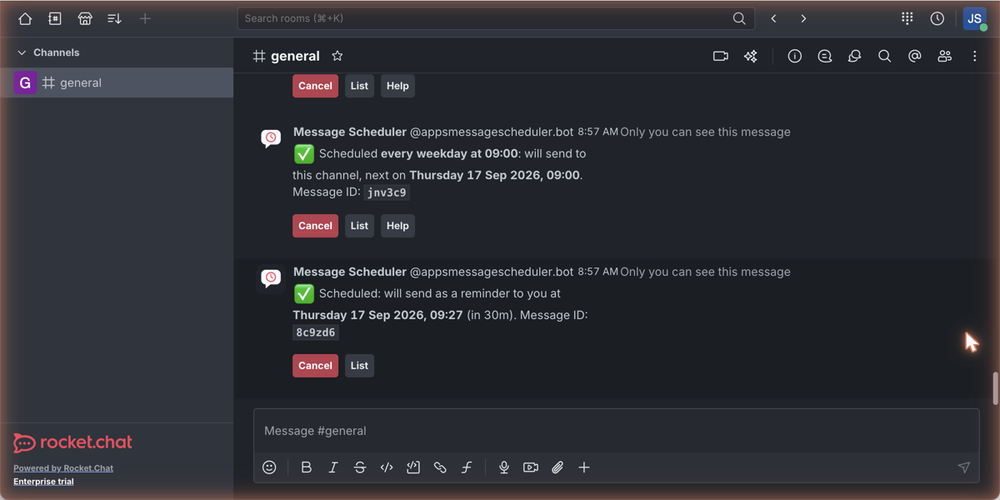
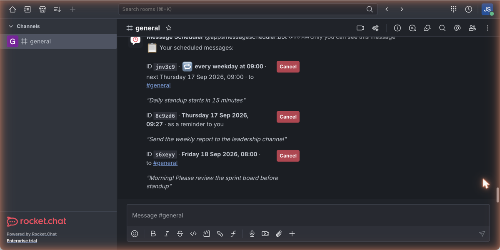
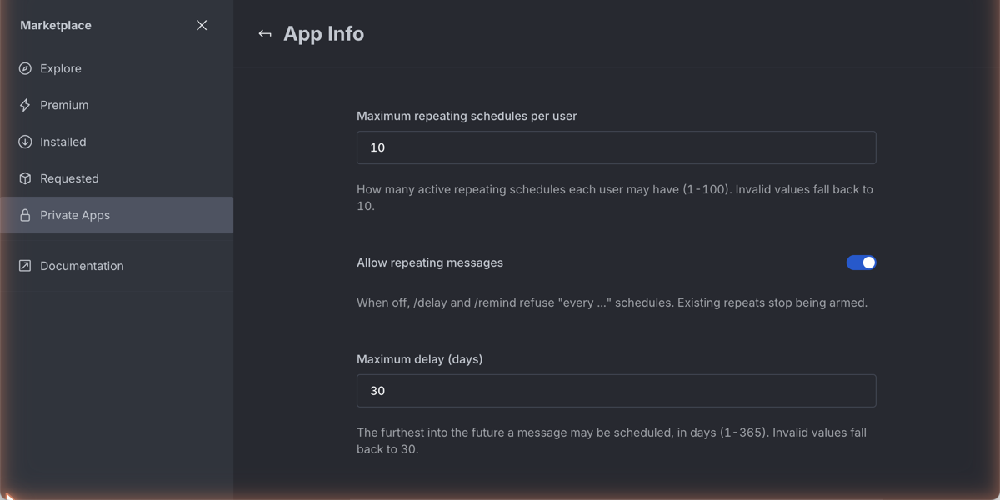

# Message Scheduler for Rocket.Chat

A Rocket.Chat app for scheduling messages. The `/delay` slash command sends a message later, as you, to the current channel, to other channels, or as a direct message to mentioned users. The `/remind` command sets personal reminders that the app bot delivers to you by direct message at the chosen time. Everything runs on the native Apps-Engine scheduler: no REST calls, no external services, and scheduled jobs survive server restarts.

## Screenshots

| | |
| --- | --- |
|  |  |
| Scheduling a message. The confirmation shows the resolved delivery time, the message id and buttons to cancel, list or get help. | A personal reminder set with `/remind`, delivered later by the app bot as a direct message. |
|  |  |
| `/delay list` shows everything pending, one-shots and repeats together, each with its own Cancel button. | The admin settings, all four validated and safe to leave at their defaults. |

## Usage

Schedule a message to the current channel:

```
/delay 5m say don't forget the standup
/delay 8h30m say the build should be finished by now
/delay 8am tomorrow say morning! please update the spreadsheet
/delay 10am next monday say sprint planning starts in 30 minutes
```

Schedule a direct message by adding one or more @mentions. Mentions and the time expression can appear in any order, as long as they come before the word `say`:

```
/delay @bob 5m say ping me when you are free
/delay 8h @bob @carol say gentle nudge: please review my PR
```

Send to other channels the same way, with one or more #channel names. Channels and @mentions can be combined in a single command, and the message goes to every listed destination:

```
/delay 10m #announcements say the maintenance window starts soon
/delay 1h #dev #ops @carol say deploy is done
```

Because the message is sent as you, the app checks that you may post into each target, both when you schedule and again when the message is due. For a private group that means you must be a member: if you left or were removed before delivery, that delivery is dropped rather than posted into a room you no longer belong to. Public channels are not restricted this way, since anyone may post into them (Rocket.Chat simply joins you when you send).

Manage your scheduled messages:

```
/delay list          shows your pending messages with their ids
/delay cancel k3x9q2 cancels one message by id
/delay cancel all    cancels everything you have scheduled
/delay help          shows the built-in help
```

Every successful schedule replies with an ephemeral confirmation showing the id, the resolved delivery time, and how far away it is, along with Cancel, List, and Help buttons.

When the app is installed, its bot sends the installing admin a direct message with the full usage guide, in the admin's own language.

## Repeating messages

Start the time expression with `every` and give a day and a time of day:

```
/delay every day at 8am say daily standup starts soon
/delay every weekday at 9am #team say morning check-in
/delay every monday at 8am say check your weekly tasks
/remind every weekday at 9am say stand-up
```

Accepted periods are `day`, `weekday` (Monday to Friday), and any weekday name. A repeat always needs a time of day, and elapsed-time repeats such as `every 2h` are not supported. The first occurrence is today, or the next matching weekday, if that time is still to come; otherwise it is the following cycle.

Repeats run until cancelled. `/delay cancel <id>`, `/delay cancel all`, and the Cancel button all stop a series, and `/delay list` shows the pattern with the next run. If you lose the right to post into a target, for example by leaving a private group, the series is cancelled and the app bot tells you which schedule stopped and why.

Repeats work by arming one delivery at a time and scheduling the next one after each send, because the Apps-Engine recurring scheduler resolves cron expressions in the server's timezone and cannot express a specific user's local time. An hourly repair sweep re-arms any series whose chain was broken, for example by the app being disabled mid-delivery.

One caveat worth knowing: Rocket.Chat exposes a user's timezone as a fixed hour offset rather than a named zone, so the app re-reads that offset before each occurrence. A series self-corrects once the user's client reports a new offset after a daylight-saving change, but an occurrence falling in that window can be an hour out.

## Personal reminders

The `/remind` command is a specialisation of the same engine for reminding yourself. It takes only a time and a message, and at the chosen time the app bot sends you a direct message such as "⏰ Reminder: check the oven". Delivery deliberately comes from the bot rather than from you: Rocket.Chat never notifies users about their own messages, so a self-sent reminder would not ping.

```
/remind 20m say check the oven
/remind 8am tomorrow say submit the report
```

`/remind list` and `/remind cancel all` manage only reminders, while `/delay list` shows everything you have scheduled, reminders included. Ids are shared, so either command can cancel by id.

## Time formats

Two styles are supported. They cannot be mixed in one command.

**Relative delays.** Units are `m` (minutes), `h` (hours), `d` (days), and `w` (weeks). Units can be combined with or without spaces: `5m`, `8h`, `2d`, `1w`, `8h30m`, `1h 30m`. A minute is the smallest delay; anything expressed in seconds is refused with a message saying so.

**Clock times.** A time of day such as `8am`, `10:30pm`, `14:30`, `noon`, or `midnight`, optionally combined with a day: `today`, `tomorrow`, a weekday name (`monday` through `sunday`, abbreviations accepted), or `next` followed by a weekday. A bare time that has already passed today rolls over to tomorrow. A weekday always means the next future occurrence of that day.

Clock times are resolved in your own timezone, taken from your Rocket.Chat profile. If your profile has no timezone set, the server timezone is used and the confirmation message warns you about it.

## Behaviour details

The message text is everything after the word `say`, taken literally. Time-like words inside the message are never parsed, so `/delay 5m say wait 10m before deploying` works as expected.

The app accepts the message text on a new line after `say`, and quoted text keeps its line breaks in the delivered message. Be aware of a Rocket.Chat client limitation, though: when a slash command is typed in the message box, the client discards everything after the first line break before it reaches any app, so a multi-line command typed with Shift+Enter loses its later lines. The app detects the resulting dangling `say` and replies with a hint to keep the command on one line. Commands sent through the REST API (`commands.run`) do not have this limitation.

When one or more users are mentioned, the message is delivered as a direct message to each of them, creating the DM room if it does not exist yet. Channel targets are stored by id, so they survive channel renames. Without any explicit targets, the message is delivered to the room where the command was typed.

Delivered messages are sent as the scheduling user, not as a bot.

You can only list and cancel your own scheduled messages.

## Settings

| Setting | Default | Description |
| ------- | ------- | ----------- |
| Maximum delay (days) | 30 | The furthest into the future a message may be scheduled, between 1 and 365 days. Invalid values are rejected in the admin log and fall back to 30. |
| Allow repeating messages | on | When off, `every ...` schedules are refused and existing repeats stop being armed. |
| Maximum repeating schedules per user | 10 | How many active repeating schedules one user may have, between 1 and 100. Invalid values fall back to 10. |
| List snippet length (characters) | 80 | How many characters of each scheduled message are shown in `/delay list` before truncation, between 20 and 500. Longer messages get a Show button that reveals the full text. Invalid values fall back to 80. |

## Internationalisation

Command metadata and settings are translated through the standard `i18n/*.json` files. Runtime strings (confirmations, errors, help text, the list output) are resolved from the catalog in `lib/i18n.ts` using each user's language preference, with regional variants matched first (`pt-BR` before `pt`) and English as the fallback.

Included languages: English, German, French, Italian, Spanish, Swedish, Portuguese, Brazilian Portuguese, and Japanese. Command keywords (`say`, `tomorrow`, `next monday`, `list`, `cancel`, `help`) are part of the syntax and stay in English in every language. Adding a language means adding one entry to the catalog in `lib/i18n.ts` (including weekday and month names) and one JSON file under `i18n/`.

The `general` key in each JSON file labels the default section on the app's settings page. Rocket.Chat groups settings without an explicit `section` under `general` and translates that name through the app's own i18n files, so without this key the header renders as the raw lowercase string.

## Development

Requirements: Node.js, the [Rocket.Chat Apps CLI](https://developer.rocket.chat/docs/apps-engine-cli) (`@rocket.chat/apps-cli`), and a Rocket.Chat server with development mode enabled.

```bash
npm install
npx tsc --noEmit        # typecheck
rc-apps package         # builds dist/message-scheduler_<version>.zip
rc-apps deploy          # deploys using .rcappsconfig
```

Create a `.rcappsconfig` with your server URL and admin credentials (it is gitignored because it contains plaintext credentials). When deploying to a server with a self-signed certificate, prefix the deploy with `NODE_TLS_REJECT_UNAUTHORIZED=0`.

### Project structure

```
AppsMessageSchedulerApp.ts        app entry point: settings, processor and command registration
commands/DelayCommand.ts          argument parsing, subcommands, scheduling, confirmations
lib/TimeParser.ts                 duration and clock-time parsing with timezone handling
lib/ScheduledMessageStore.ts      persistence records backing list and cancel
lib/MessageDelivery.ts            DM room resolution and send-as-user helper
lib/Notifications.ts              ephemeral notification helper (sent by the app user)
processors/SendScheduledMessage.ts  scheduler processor that delivers the message
lib/i18n.ts                       runtime string catalog (9 languages)
i18n/                             metadata translations
icon.svg                          vector master for icon.png (render at 512px)
```

### App Info page fields

The name, the subtitle under it, and the Description section on the App Info page come from `name`, `shortDescription`, and `description` in `app.json`. `shortDescription` is not part of the documented manifest type, but unknown manifest fields survive packaging and installation, and the admin UI renders it for private apps just as it does for marketplace apps. The Documentation link on the same page cannot be set for a private app; it only exists in marketplace metadata.

### Build requirements

Use apps-cli 1.14.0 or later. Older CLI releases (1.12.x) bundle an apps-compiler that looks for the engine's permission definitions at a path that moved in apps-engine 1.64, so `rc-apps package` fails with `Cannot find module '@rocket.chat/apps-engine/server/permissions/AppPermissions'` whenever `app.json` declares a `permissions` array. The compiler shipped with 1.14.0 handles both paths, and this app declares its permissions explicitly (`slashcommand`, `scheduler`, `persistence`, `message.write`, `room.read`, `room.write`, `user.read`, `server-setting.read`).

`requiredApiVersion` in `app.json` is `>=1.64.0`, an open-ended range rather than an exact version or a caret. The server installs an app only when its own Apps-Engine version satisfies that expression, so an exact pin makes the app installable on one engine build and nothing else, and a caret range (`^1.64.0`) stops at the next major: it is refused by pre-release servers carrying Apps-Engine 2.x, where the engine runtime moves from Deno to Node.

The `@rocket.chat/apps-engine` devDependency in `package.json` stays a caret range (`^1.64.0`) so local typechecking resolves a stable 1.x release. The CLI compares the two with `semver.coerce`, which reduces both `^1.64.0` and `>=1.64.0` to `1.64.0`, so it treats them as the same version and leaves `app.json` alone. Changing either side to a different base version makes the CLI rewrite `requiredApiVersion` from `package.json` on the next package or deploy.

Two things to know about how a version mismatch is reported. The server strips any pre-release suffix before comparing, so an engine reported as `2.0.0-alpha.112` is matched as `2.0.0`. And when the comparison fails, `RequiredApiVersionError` calls `semver.gt` with the app's `requiredApiVersion` as if it were a concrete version, which throws on any range. The real message is lost and the admin UI shows the thrown text instead, for example `Apps_Error_Invalid Version: ^1.64.0`. Read that error as "this server's engine is outside the range you declared", not as a malformed manifest.

## Licence

MIT
